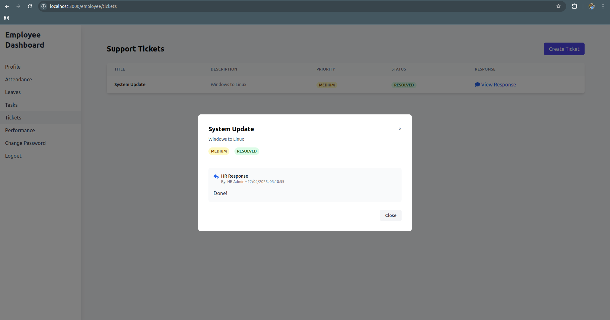

# HR Management System

A comprehensive MERN stack (MongoDB, Express.js, React.js, Node.js) HR Management System designed to streamline human resources operations, employee management, and organizational workflows.

## Table of Contents

- [Features](#features)
- [Tech Stack](#tech-stack)
- [System Requirements](#system-requirements)
- [Installation](#installation)
- [Project Structure](#project-structure)
- [API Endpoints](#api-endpoints)
- [Usage Guide](#usage-guide)
- [Screenshots](#screenshots)
- [Contributing](#contributing)
- [License](#license)

## Features

### Authentication & Security
- **Role-Based Access Control**: HR and Employee portals with different permissions
- **Secure Authentication**: JWT-based authentication with token expiration
- **Password Management**: Change password functionality with bcrypt encryption
- **Default Password System**: Initial default passwords for new employees

### Employee Management
- **Employee Profiles**: Comprehensive employee information management
- **Department & Team Structure**: Organize employees by departments and teams
- **Employee Performance Tracking**: Record and analyze employee performance
- **Employee Search & Filtering**: Find employees by various parameters

### Attendance Management
- **Check-In/Check-Out System**: Real-time attendance tracking for employees
- **Attendance Records**: Historical attendance data with detailed views
- **Attendance Analytics**: Reports on attendance patterns and statistics
- **Manual Attendance Management**: HR can add, edit, and delete attendance records
- **Time Format**: Human-readable work hours (e.g., "8 hours 30 minutes")

### Leave Management
- **Leave Requests**: Employees can request time off
- **Leave Approval Workflow**: HR can approve or reject leave requests
- **Leave Balance Tracking**: Track different types of leave balances
- **Leave Calendar**: Visual calendar view of approved leaves

### Task Management
- **Task Assignment**: Assign tasks to employees with due dates
- **Progress Tracking**: Monitor task completion status
- **Task Priorities**: Set task importance levels
- **Task Notifications**: Alert employees of new or updated tasks

### Performance Evaluation
- **Performance Reviews**: Structured evaluation of employee performance
- **KPI Tracking**: Monitor key performance indicators
- **Goal Setting**: Set and track employee goals
- **Review Cycles**: Regular performance review scheduling

### Salary Management
- **Salary Structure**: Define and manage salary components
- **Salary History**: Track salary changes over time
- **Payroll Processing**: Calculate salaries including deductions
- **Compensation Management**: Manage bonuses and other compensation

### Ticket System
- **Support Tickets**: Internal ticketing for employee requests
- **Ticket Tracking**: Monitor ticket status and responses
- **Priority Management**: Assign importance to different tickets
- **Resolution Workflow**: Track ticket resolution process

## Tech Stack

### Frontend
- **React.js**: UI library for building interactive interfaces
- **Tailwind CSS**: Utility-first CSS framework for responsive design
- **Context API**: State management for authentication and user data
- **React Router**: Navigation and routing between components
- **Axios**: HTTP client for API requests
- **React Icons**: Icon library for UI elements

### Backend
- **Node.js**: JavaScript runtime for server-side logic
- **Express.js**: Web framework for building RESTful APIs
- **MongoDB**: NoSQL database for data storage
- **Mongoose**: MongoDB object modeling for data structure
- **JWT**: Authentication token management
- **Bcrypt**: Password hashing and security

## System Requirements

### For Ubuntu/Debian
```bash
# Node.js and npm
curl -fsSL https://deb.nodesource.com/setup_18.x | sudo -E bash -
sudo apt-get install -y nodejs

# MongoDB
sudo apt-get install gnupg
curl -fsSL https://pgp.mongodb.com/server-6.0.asc | \
   sudo gpg -o /usr/share/keyrings/mongodb-server-6.0.gpg \
   --dearmor
echo "deb [ signed-by=/usr/share/keyrings/mongodb-server-6.0.gpg] http://repo.mongodb.org/apt/debian bullseye/mongodb-org/6.0 main" | sudo tee /etc/apt/sources.list.d/mongodb-org-6.0.list
sudo apt-get update
sudo apt-get install -y mongodb-org
```

### For macOS
```bash
# Node.js and npm
brew install node

# MongoDB
brew tap mongodb/brew
brew install mongodb-community
```

### For Windows
1. Download and install Node.js from [nodejs.org](https://nodejs.org)
2. Download and install MongoDB from [mongodb.com](https://www.mongodb.com/try/download/community)

## Installation

### 1. Clone Repository
```bash
git clone <repository-url>
cd hrms
```

### 2. Install Server Dependencies
```bash
cd server
npm install
```

### 3. Install Client Dependencies
```bash
cd ../client
npm install
```

### 4. Environment Setup

Create `.env` in server directory:
```env
PORT=5000
MONGO_URI=mongodb://localhost:27017/hrms_db
JWT_SECRET=your_secure_jwt_secret_key_123
HR_EMAIL=hr@company.com
HR_PASSWORD=hr_password
DEFAULT_EMPLOYEE_PASSWORD=password123
```

Create `.env` in client directory:
```env
VITE_API_URL=http://localhost:5000
```

### 5. Database Initialization

Start MongoDB service:
```bash
# Ubuntu/Debian
sudo systemctl start mongod

# macOS
brew services start mongodb-community

# Windows
# MongoDB should start automatically after installation
```

Create MongoDB database:
```bash
mongosh
use hrms_db
```

### 6. Initialize System and Create HR User
```bash
cd ../server
node scripts/setupHR.js
```

### 7. Reset Passwords (Optional)
```bash
node scripts/resetPasswords.js
```

## Running the Application

### Start the Backend Server
```bash
cd server
npm run dev
```

### Start the Frontend Development Server
```bash
cd client
npm run dev
```

The application will be available at:
- Frontend: http://localhost:5173
- Backend: http://localhost:5000

### Default Credentials

- **HR Login**
  - Email: As set in HR_EMAIL environment variable (default: hr@company.com)
  - Password: As set in HR_PASSWORD environment variable (default: hr_password)

- **Employee Login**
  - Email: Employee's registered email (created by HR)
  - Initial Password: As set in DEFAULT_EMPLOYEE_PASSWORD (default: password123)

## Project Structure

```
hrms/
├── client/                 # React frontend
│   ├── public/            # Static files
│   │   ├── components/    # Reusable components
│   │   │   ├── hr/       # HR dashboard pages
│   │   │   └── employee/ # Employee dashboard pages
│   │   ├── context/      # React context providers
│   │   ├── hooks/        # Custom hooks
│   │   └── utils/        # Utility functions
│   └── package.json
│
├── server/                # Express backend
│   ├── config/           # Configuration files
│   ├── middleware/       # Custom middleware
│   ├── models/          # Mongoose models
│   ├── routes/          # API routes
│   ├── scripts/         # Utility scripts
│   └── package.json
│
└── README.md
```

## API Endpoints

### Authentication
- `POST /api/auth/hr/login` - HR Login
- `POST /api/auth/employee/login` - Employee Login
- `POST /api/auth/change-password` - Change Password

### Employees
- `GET /api/employees` - Get all employees
- `POST /api/employees` - Create new employee
- `GET /api/employees/:id` - Get employee by ID
- `PUT /api/employees/:id` - Update employee
- `DELETE /api/employees/:id` - Delete employee

### Attendance
- `GET /api/attendance` - Get all attendance records (HR only)
- `GET /api/attendance/employee/:employeeId` - Get employee attendance
- `POST /api/attendance` - Create attendance record (HR only)
- `POST /api/attendance/check-in` - Employee check-in
- `POST /api/attendance/check-out` - Employee check-out
- `PUT /api/attendance/:id` - Update attendance (HR only)
- `DELETE /api/attendance/:id` - Delete attendance (HR only)

### Leaves
- `GET /api/leaves` - Get all leave requests
- `POST /api/leaves` - Create leave request
- `GET /api/leaves/:id` - Get leave by ID
- `PUT /api/leaves/:id` - Update leave status
- `DELETE /api/leaves/:id` - Delete leave request

### Tasks
- `GET /api/tasks` - Get all tasks
- `POST /api/tasks` - Create task
- `GET /api/tasks/:id` - Get task by ID
- `PUT /api/tasks/:id` - Update task
- `DELETE /api/tasks/:id` - Delete task

### Performance
- `GET /api/performance` - Get performance reviews
- `POST /api/performance` - Add performance review
- `PUT /api/performance/:id` - Update performance review

### Teams
- `GET /api/teams` - Get all teams
- `POST /api/teams` - Create team
- `GET /api/teams/:id` - Get team by ID
- `PUT /api/teams/:id` - Update team
- `DELETE /api/teams/:id` - Delete team

### Salaries
- `GET /api/salaries` - Get all salaries
- `POST /api/salaries` - Create salary record
- `GET /api/salaries/employee/:id` - Get employee salary history
- `PUT /api/salaries/:id` - Update salary

## Usage Guide

### HR Dashboard
1. **Login** using HR credentials
2. **Employee Management**: Create, update, or delete employee records
3. **Attendance Management**: Track employee attendance, add manual records, export reports
4. **Leave Management**: Approve or reject leave requests
5. **Task Assignment**: Create and assign tasks to employees
6. **Performance Reviews**: Conduct and record employee performance evaluations
7. **Team Management**: Create and manage team structures
8. **Salary Management**: Configure and update employee compensation

### Employee Dashboard
1. **Login** using employee credentials
2. **Profile**: View and update personal information
3. **Attendance**: Check in and out, view attendance history
4. **Leave Requests**: Submit and track leave applications
5. **Tasks**: View assigned tasks, update progress
6. **Performance**: Access performance reviews and feedback
7. **Teams**: View team information and members
8. **Salary**: View salary information and history

## Screenshots

This section contains screenshots of key features and interfaces of the HRMS application. All screenshots are stored in the `screenshots` folder.

### Login Screen


### HR Dashboard


### Employee Dashboard




### Account Management


For more information on adding screenshots, refer to the [screenshots/README.md](./screenshots/README.md) file.

## Contributing

1. Fork the repository
2. Create your feature branch (`git checkout -b feature/AmazingFeature`)
3. Commit your changes (`git commit -m 'Add some AmazingFeature'`)
4. Push to the branch (`git push origin feature/AmazingFeature`)
5. Open a Pull Request

## License

This project is licensed under the MIT License - see the LICENSE file for details. 